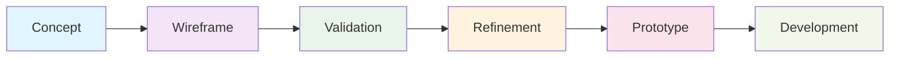
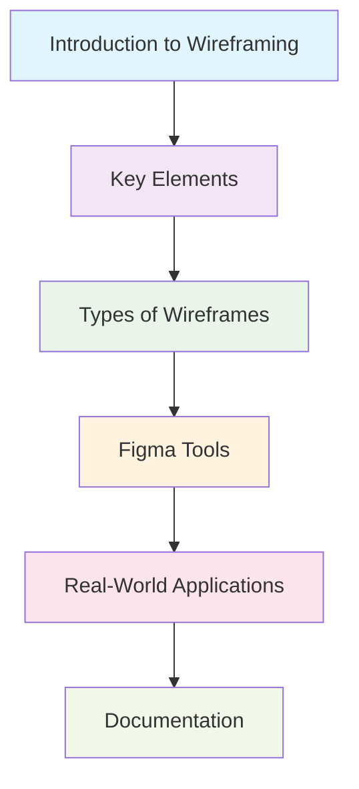

<div align="center">

# Wireframing: From Wireframe to Prototype

[](https://github.com)
[](https://figma.com)
[](https://adobe.com)
[](https://sketch.com)

> **A comprehensive guide to mastering wireframing fundamentals and transitioning from concept to functional prototypes**

[](https://opensource.org/licenses/MIT)
[](http://makeapullrequest.com)
[](https://github.com)

</div>

---

## 📋 Table of Contents

- [Overview](#overview)
- [Strategic Importance](#strategic-importance)
- [Methodology](#methodology)
- [Value Proposition](#value-proposition)
- [Getting Started](#getting-started)
- [Contributing](#contributing)
- [License](#license)

---

## 🎯 Overview

<div align="center">


</div>

Wireframing represents the foundational architecture of digital product design—a systematic approach to creating low-fidelity visual blueprints that establish structure, functionality, and user experience before visual design implementation.

### Core Definition

Wireframes serve as the skeletal framework of digital interfaces, presenting simplified, monochromatic layouts that prioritize functionality and user flow over aesthetic elements. These structural foundations establish the blueprint upon which all subsequent design decisions are built.

### Fundamental Characteristics

<table>
<tr>
<td width="50%">

**Structural Focus**

- Layout hierarchy optimization
- Information architecture design
- Content organization strategy

</td>
<td width="50%">

**Functional Clarity**

- User interaction patterns
- Navigation flow mapping
- Interface behavior definition

</td>
</tr>
<tr>
<td>

**Rapid Iteration**

- Quick concept exploration
- Design refinement cycles
- Prototype testing

</td>
<td>

**Collaborative Foundation**

- Cross-team communication
- Stakeholder alignment
- Clear specification sharing

</td>
</tr>
</table>

---

## 🚀 Strategic Importance

<div align="center">

| Aspect                     | Impact                     | Benefit                   |
| -------------------------- | -------------------------- | ------------------------- |
| **Risk Mitigation**        | Early issue identification | Reduced development costs |
| **Communication**          | Universal visual language  | Eliminated ambiguity      |
| **User-Centric Design**    | Focus on functionality     | Improved user experience  |
| **Iterative Development**  | Rapid prototyping          | Faster time to market     |
| **Development Efficiency** | Clear specifications       | Reduced rework            |

</div>

### Early Risk Mitigation

Wireframes function as predictive tools, identifying usability challenges, navigation inconsistencies, and structural deficiencies before development resources are allocated.

<div align="center">



</div>

### Cross-Functional Communication

Wireframes establish a universal visual language that bridges communication gaps between designers, developers, stakeholders, and clients.

---

## 🔧 Methodology

<div align="center">


</div>

### Phase 1: Strategic Foundation

<details>
<summary>Click to expand</summary>

- Comprehensive user research and requirement analysis
- Competitive landscape evaluation and industry benchmarking
- User persona development and use case definition
- Business objective alignment and success metrics

</details>

### Phase 2: Information Architecture

<details>
<summary>Click to expand</summary>

- Logical content organization and feature prioritization
- Navigation structure design and user flow mapping
- Information hierarchy establishment
- Content strategy and taxonomy development

</details>

### Phase 3: Wireframe Development

<details>
<summary>Click to expand</summary>

- Low-fidelity conceptual sketches
- Digital wireframe creation using professional tools
- Layout optimization and content placement refinement
- Interactive element specification

</details>

### Phase 4: Validation and Refinement

<details>
<summary>Click to expand</summary>

- Stakeholder feedback collection and analysis
- User testing and usability assessment
- Iterative wireframe optimization
- Performance metrics evaluation

</details>

### Phase 5: Prototype Evolution

<details>
<summary>Click to expand</summary>

- Interactive prototype development
- Visual design integration
- Development handoff preparation
- Quality assurance testing

</details>

---

## 💎 Value Proposition

<div align="center">


</div>

### Design Excellence

<div align="center">

| Benefit                   | Description                                             | Impact                  |
| ------------------------- | ------------------------------------------------------- | ----------------------- |
| **Conceptual Clarity**    | Enhanced ability to visualize complex user interactions | Improved design quality |
| **Workflow Optimization** | Accelerated design iteration and concept refinement     | Faster delivery         |
| **Team Synergy**          | Improved collaboration and stakeholder communication    | Better outcomes         |

</div>

### Development Precision

<div align="center">

| Benefit                   | Description                                                | Impact          |
| ------------------------- | ---------------------------------------------------------- | --------------- |
| **Specification Clarity** | Detailed wireframes provide precise development guidelines | Reduced rework  |
| **Efficiency Gains**      | Reduced rework through early design validation             | Cost savings    |
| **Project Planning**      | Enhanced scope definition and timeline estimation          | Better planning |

</div>

### Stakeholder Confidence

<div align="center">

| Benefit                  | Description                                            | Impact              |
| ------------------------ | ------------------------------------------------------ | ------------------- |
| **Visual Comprehension** | Tangible representation of abstract concepts           | Clear understanding |
| **Early Engagement**     | Opportunity for input before development commitment    | Better alignment    |
| **Risk Reduction**       | Increased confidence in project direction and outcomes | Reduced uncertainty |

</div>

---

## 🚀 Getting Started

<div align="center">

[](https://github.com)

</div>

### Prerequisites

- [ ] GitHub account for project management
- [ ] Figma access for wireframing tools
- [ ] Basic understanding of UI/UX concepts
- [ ] Markdown proficiency for documentation

### Quick Start

```bash
# Clone the repository
git clone https://github.com/yourusername/wireframing.git

# Navigate to the project directory
cd wireframing

# Start exploring the wireframing concepts
```

### Learning Path

<div align="center">



</div>

---

## 🤝 Contributing

<div align="center">

[](https://github.com)

</div>

We welcome contributions to improve this wireframing guide. Please follow these steps:

1. Fork the repository
2. Create a feature branch (`git checkout -b feature/AmazingFeature`)
3. Commit your changes (`git commit -m 'Add some AmazingFeature'`)
4. Push to the branch (`git push origin feature/AmazingFeature`)
5. Open a Pull Request

### Contribution Guidelines

- Ensure all content is professional and well-documented
- Follow the existing markdown formatting style
- Include relevant examples and case studies
- Test all links and references

---

## 📄 License

<div align="center">

[](https://opensource.org/licenses/MIT)

</div>

This project is licensed under the MIT License - see the [LICENSE](LICENSE) file for details.

---

<div align="center">

**Wireframing: From Wireframe to Prototype** - A comprehensive guide to mastering wireframing fundamentals and transitioning from concept to functional prototypes.

[](https://github.com/yourusername/wireframing)
[](https://github.com/yourusername/wireframing)
[](https://github.com/yourusername/wireframing/issues)

</div>
