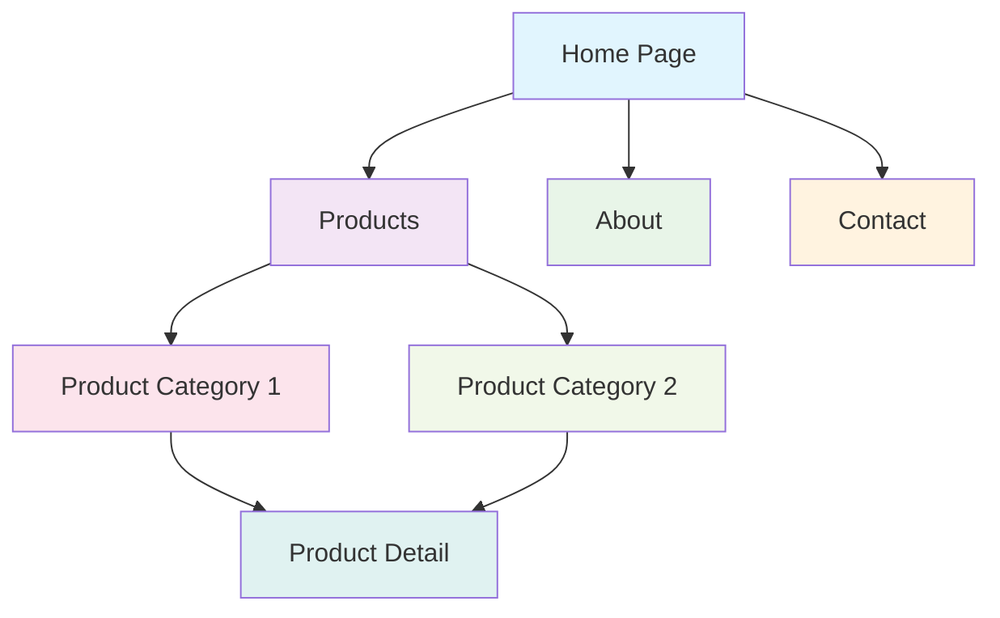
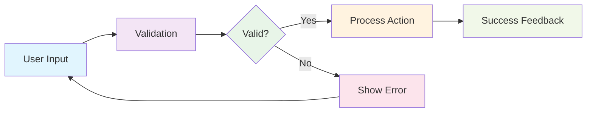
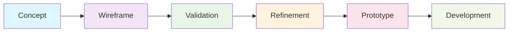
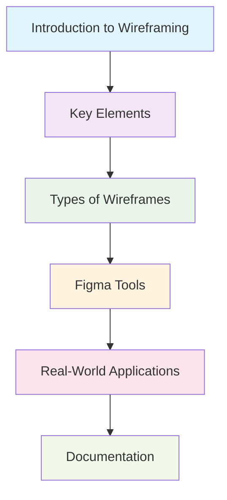

<div align="center">

# Wireframing: From Wireframe to Prototype

[](https://github.com)
[](https://figma.com)
[](https://adobe.com)
[](https://sketch.com)

> **A comprehensive guide to mastering wireframing fundamentals and transitioning from concept to functional prototypes**

[](https://opensource.org/licenses/MIT)
[](http://makeapullrequest.com)
[](https://github.com)

</div>

---

## 📋 Table of Contents

- [Overview](#overview)
- [Key Elements of Wireframing](#key-elements-of-wireframing)
- [Types of Wireframes](#types-of-wireframes)
- [Strategic Importance](#strategic-importance)
- [Methodology](#methodology)
- [Value Proposition](#value-proposition)
- [Getting Started](#getting-started)
- [Contributing](#contributing)
- [License](#license)

---

## 🎯 Overview

<div align="center">


</div>

Wireframing represents the foundational architecture of digital product design—a systematic approach to creating low-fidelity visual blueprints that establish structure, functionality, and user experience before visual design implementation.

### Core Definition

Wireframes serve as the skeletal framework of digital interfaces, presenting simplified, monochromatic layouts that prioritize functionality and user flow over aesthetic elements. These structural foundations establish the blueprint upon which all subsequent design decisions are built.

### Fundamental Characteristics

<table>
<tr>
<td width="50%">

**Structural Focus**

- Layout hierarchy optimization
- Information architecture design
- Content organization strategy

</td>
<td width="50%">

**Functional Clarity**

- User interaction patterns
- Navigation flow mapping
- Interface behavior definition

</td>
</tr>
<tr>
<td>

**Rapid Iteration**

- Quick concept exploration
- Design refinement cycles
- Prototype testing

</td>
<td>

**Collaborative Foundation**

- Cross-team communication
- Stakeholder alignment
- Clear specification sharing

</td>
</tr>
</table>

---

## 🏗️ Key Elements of Wireframing

<div align="center">


</div>

Wireframes are composed of four fundamental elements that work together to create effective user interfaces. Understanding these elements is crucial for creating wireframes that effectively communicate design intent and user experience.

### Layout Structure

Layout structure establishes the foundational framework of the interface, defining how elements are organized and positioned within the design space.

#### Core Components

<div align="center">

| Component              | Purpose                                                | Example                                                   |
| ---------------------- | ------------------------------------------------------ | --------------------------------------------------------- |
| **Grid System**        | Establishes consistent spacing and alignment           | 12-column responsive grid for content organization        |
| **Container Elements** | Defines content boundaries and grouping                | Header, main content area, sidebar, footer containers     |
| **White Space**        | Creates visual hierarchy and breathing room            | Strategic spacing between sections and elements           |
| **Alignment**          | Ensures visual consistency and professional appearance | Left-aligned text, centered navigation, justified content |

</div>

#### Design Impact

- **Visual Hierarchy**: Establishes clear information priority through size and positioning
- **Responsive Foundation**: Provides structure that adapts to different screen sizes
- **Consistency**: Ensures uniform spacing and alignment across all interface elements
- **Scalability**: Creates patterns that can be applied consistently throughout the application

#### Example Implementation

```html
<!-- Layout Structure Example -->
<div class="container">
  <header class="header">
    <!-- Navigation and branding -->
  </header>

  <main class="main-content">
    <section class="hero-section">
      <!-- Primary content area -->
    </section>

    <aside class="sidebar">
      <!-- Secondary content -->
    </aside>
  </main>

  <footer class="footer">
    <!-- Footer content -->
  </footer>
</div>
```

### Navigation

Navigation defines how users move through the interface and access different sections of the application.

#### Navigation Types

<div align="center">

| Type                      | Description                             | Use Case                                   |
| ------------------------- | --------------------------------------- | ------------------------------------------ |
| **Primary Navigation**    | Main menu for core application sections | Website header navigation, app main menu   |
| **Secondary Navigation**  | Supporting navigation for sub-sections  | Sidebar navigation, breadcrumbs            |
| **Contextual Navigation** | Situation-specific navigation options   | In-page links, related content suggestions |
| **Utility Navigation**    | Functional navigation elements          | Search, user account, settings, help       |

</div>

#### User Experience Benefits

- **Intuitive Flow**: Guides users through logical information pathways
- **Reduced Cognitive Load**: Minimizes the effort required to find information
- **Consistent Patterns**: Establishes predictable navigation behaviors
- **Accessibility**: Ensures all users can navigate effectively

#### Navigation Wireframe Example

<div align="center">



</div>

### Content Placement

Content placement determines how information is organized and presented to users, influencing comprehension and engagement.

#### Content Hierarchy

<div align="center">

| Level                    | Description                | Examples                                           |
| ------------------------ | -------------------------- | -------------------------------------------------- |
| **Primary Content**      | Most important information | Headlines, main features, call-to-action buttons   |
| **Secondary Content**    | Supporting information     | Descriptions, additional features, related content |
| **Tertiary Content**     | Supplementary details      | Metadata, tags, timestamps, author information     |
| **Interactive Elements** | User engagement components | Forms, buttons, links, media players               |

</div>

#### Content Organization Principles

- **F-Pattern Layout**: Aligns with natural eye movement patterns
- **Progressive Disclosure**: Reveals information as needed to avoid overwhelming users
- **Content Grouping**: Logically organizes related information together
- **Visual Weight**: Uses size and positioning to indicate content importance

#### Content Placement Strategy

<table>
<tr>
<td width="50%">

**Above the Fold**

- Primary headline and value proposition
- Main call-to-action buttons
- Key navigation elements
- Essential functionality

</td>
<td width="50%">

**Below the Fold**

- Detailed information and features
- Supporting content and examples
- Secondary navigation options
- Additional engagement elements

</td>
</tr>
</table>

### Functionality

Functionality defines the interactive behaviors and capabilities that enable users to accomplish their goals within the interface.

#### Functional Elements

<div align="center">

| Element Type               | Purpose                         | Examples                                           |
| -------------------------- | ------------------------------- | -------------------------------------------------- |
| **Input Controls**         | User data entry and interaction | Text fields, checkboxes, radio buttons, dropdowns  |
| **Action Buttons**         | Trigger specific functions      | Submit, save, delete, share, like buttons          |
| **Interactive Components** | Enhanced user engagement        | Sliders, toggles, progress bars, carousels         |
| **Feedback Mechanisms**    | System response and status      | Loading indicators, success messages, error states |

</div>

#### User Interaction Patterns

- **Form Interactions**: Data input, validation, and submission workflows
- **Navigation Interactions**: Page transitions, menu expansions, breadcrumb navigation
- **Content Interactions**: Content filtering, sorting, searching, and pagination
- **System Interactions**: Settings configuration, user preferences, account management

#### Functionality Wireframe Example

<div align="center">



</div>

#### Interactive States

<div align="center">

| State        | Description                    | Design Consideration                              |
| ------------ | ------------------------------ | ------------------------------------------------- |
| **Default**  | Normal, unselected state       | Clear visual hierarchy and affordance             |
| **Hover**    | Mouse pointer interaction      | Subtle visual feedback indicating interactivity   |
| **Active**   | Currently selected or pressed  | Clear indication of current state                 |
| **Disabled** | Unavailable functionality      | Visual indication that element is not interactive |
| **Error**    | Invalid input or failed action | Clear error messaging and visual cues             |

</div>

### Element Integration

The four key elements work together to create cohesive wireframes that effectively communicate design intent:

<div align="center">

| Element Combination            | Purpose                                            | Example                                             |
| ------------------------------ | -------------------------------------------------- | --------------------------------------------------- |
| **Layout + Navigation**        | Establishes site structure and user pathways       | Header navigation within grid-based layout          |
| **Content + Functionality**    | Presents information with interactive capabilities | Product listings with filtering and sorting options |
| **Navigation + Functionality** | Enables user movement and interaction              | Breadcrumb navigation with clickable elements       |
| **Layout + Content**           | Organizes information for optimal comprehension    | Content blocks arranged in logical hierarchy        |

</div>

### Wireframe Element Checklist

<details>
<summary>Layout Structure Checklist</summary>

- [ ] Grid system established and consistent
- [ ] Container elements properly defined
- [ ] White space strategically applied
- [ ] Alignment patterns established
- [ ] Responsive considerations included

</details>

<details>
<summary>Navigation Checklist</summary>

- [ ] Primary navigation clearly defined
- [ ] Secondary navigation options identified
- [ ] Navigation hierarchy established
- [ ] User flow pathways mapped
- [ ] Accessibility considerations included

</details>

<details>
<summary>Content Placement Checklist</summary>

- [ ] Content hierarchy established
- [ ] Information architecture defined
- [ ] Content grouping logical and intuitive
- [ ] Progressive disclosure planned
- [ ] Visual weight appropriately distributed

</details>

<details>
<summary>Functionality Checklist</summary>

- [ ] Interactive elements identified
- [ ] User interaction patterns defined
- [ ] Input controls and forms planned
- [ ] Feedback mechanisms established
- [ ] Error states and validation considered

</details>

---

## 📊 Types of Wireframes

<div align="center">


</div>

Wireframes exist on a spectrum from low-fidelity to high-fidelity, each serving distinct purposes in the design process. Understanding when and how to use each type is crucial for effective wireframing workflows.

### Low-Fidelity Wireframes

Low-fidelity wireframes are the foundational building blocks of the design process, focusing on structure and functionality over visual details.

#### Characteristics

<div align="center">

| Aspect            | Description                                     | Example                                     |
| ----------------- | ----------------------------------------------- | ------------------------------------------- |
| **Visual Detail** | Minimal visual elements, basic shapes and lines | Rectangles for content blocks, simple icons |
| **Color Usage**   | Monochromatic or limited color palette          | Black, white, and grays only                |
| **Typography**    | Basic font representation                       | Generic text placeholders                   |
| **Content**       | Lorem ipsum or placeholder text                 | "Sample text" or "Content here"             |
| **Interactions**  | Basic interaction indicators                    | Simple arrows or notes                      |

</div>

#### When to Use Low-Fidelity Wireframes

<div align="center">

| Design Phase                 | Purpose                             | Benefits                                       |
| ---------------------------- | ----------------------------------- | ---------------------------------------------- |
| **Discovery**                | Initial concept exploration         | Rapid iteration and idea generation            |
| **Information Architecture** | Content organization and hierarchy  | Focus on structure without visual distractions |
| **User Flow Mapping**        | Navigation and interaction planning | Clear user journey visualization               |
| **Stakeholder Review**       | Early feedback and validation       | Quick comprehension and feedback               |
| **Team Collaboration**       | Cross-functional communication      | Universal understanding across disciplines     |

</div>

#### Advantages

- **Speed**: Quick to create and modify
- **Focus**: Emphasizes functionality over aesthetics
- **Flexibility**: Easy to iterate and refine
- **Cost-Effective**: Minimal time investment
- **Collaborative**: Accessible to all team members

#### Limitations

- **Limited Detail**: May miss important visual considerations
- **Stakeholder Confusion**: Some stakeholders may struggle with abstraction
- **User Testing Limitations**: May not capture all user interaction nuances

### High-Fidelity Wireframes

High-fidelity wireframes provide detailed representations that closely resemble the final product, incorporating visual design elements and specific content.

#### Characteristics

<div align="center">

| Aspect            | Description                                    | Example                                        |
| ----------------- | ---------------------------------------------- | ---------------------------------------------- |
| **Visual Detail** | Detailed visual elements and realistic content | Actual images, icons, and graphics             |
| **Color Usage**   | Full color palette and brand colors            | Complete visual design system                  |
| **Typography**    | Specific fonts and typography hierarchy        | Real font families and sizing                  |
| **Content**       | Actual copy and real content                   | Final text, images, and media                  |
| **Interactions**  | Detailed interaction states and animations     | Hover effects, transitions, micro-interactions |

</div>

#### When to Use High-Fidelity Wireframes

<div align="center">

| Design Phase            | Purpose                           | Benefits                               |
| ----------------------- | --------------------------------- | -------------------------------------- |
| **Detailed Design**     | Final design specification        | Precise visual and interaction details |
| **User Testing**        | Comprehensive usability testing   | Realistic user experience evaluation   |
| **Client Presentation** | Stakeholder approval and sign-off | Clear vision of final product          |
| **Development Handoff** | Technical implementation guidance | Detailed specifications for developers |
| **Quality Assurance**   | Final review and validation       | Comprehensive design verification      |

</div>

#### Advantages

- **Detail Accuracy**: Precise representation of final product
- **User Testing**: Realistic user experience evaluation
- **Stakeholder Clarity**: Clear vision for non-technical stakeholders
- **Development Ready**: Detailed specifications for implementation
- **Quality Assurance**: Comprehensive design validation

#### Limitations

- **Time Investment**: Significant creation and modification time
- **Iteration Cost**: Expensive to make changes
- **Focus Shift**: May distract from functionality to aesthetics
- **Resource Intensive**: Requires more design expertise and tools

### Comparison Matrix

<div align="center">

| Factor                   | Low-Fidelity | High-Fidelity |
| ------------------------ | ------------ | ------------- |
| **Creation Speed**       | Very Fast    | Slow          |
| **Modification Ease**    | Very Easy    | Difficult     |
| **Cost**                 | Low          | High          |
| **Detail Level**         | Basic        | Comprehensive |
| **Stakeholder Clarity**  | Variable     | High          |
| **User Testing Value**   | Limited      | Comprehensive |
| **Development Guidance** | Basic        | Detailed      |
| **Iteration Frequency**  | High         | Low           |

</div>

### Design Process Integration

```mermaid
graph LR
    A[Project Start] --> B[Low-Fidelity Sketches]
    B --> C[Low-Fidelity Digital]
    C --> D[User Testing & Feedback]
    D --> E[Refinement]
    E --> F[High-Fidelity Wireframes]
    F --> G[Final Testing]
    G --> H[Development Handoff]

    style A fill:#e1f5fe
    style B fill:#f3e5f5
    style C fill:#e8f5e8
    style D fill:#fff3e0
    style E fill:#fce4ec
    style F fill:#f1f8e9
    style G fill:#e0f2f1
    style H fill:#f9fbe7
```

<div align="center">



</div>

### When to Transition Between Types

#### Low to High-Fidelity Transition Triggers

<details>
<summary>Click to expand</summary>

- **Stakeholder Approval**: Low-fidelity concepts have been validated
- **User Testing Completion**: Core functionality has been tested and refined
- **Design System Ready**: Visual design system and brand guidelines established
- **Development Timeline**: Sufficient time for detailed wireframe creation
- **Resource Availability**: Design team has capacity for detailed work

</details>

#### High-Fidelity Considerations

<details>
<summary>Click to expand</summary>

- **Content Finalization**: Actual copy and media assets available
- **Brand Guidelines**: Complete visual design system established
- **Technical Constraints**: Development platform and technology stack defined
- **User Research**: Comprehensive user testing and feedback incorporated
- **Project Timeline**: Adequate time for detailed design and testing

</details>

### Tool Selection by Fidelity Level

<div align="center">

| Fidelity Level      | Recommended Tools                          | Use Cases                                                        |
| ------------------- | ------------------------------------------ | ---------------------------------------------------------------- |
| **Low-Fidelity**    | Paper, Whiteboard, Balsamiq, Figma (basic) | Rapid prototyping, brainstorming, early concepts                 |
| **Medium-Fidelity** | Figma, Sketch, Adobe XD                    | Detailed wireframes, user testing, stakeholder review            |
| **High-Fidelity**   | Figma, Sketch, Adobe XD, InVision          | Final specifications, development handoff, comprehensive testing |

</div>

### Best Practices

#### Low-Fidelity Best Practices

<div align="center">

| Practice                    | Description                            | Benefit                              |
| --------------------------- | -------------------------------------- | ------------------------------------ |
| **Keep It Simple**          | Use basic shapes and minimal detail    | Focus on functionality and structure |
| **Iterate Rapidly**         | Make quick changes and test frequently | Faster validation and refinement     |
| **Use Placeholder Content** | Lorem ipsum and generic images         | Avoid content distraction            |
| **Focus on Flow**           | Emphasize user journey and navigation  | Clear user experience planning       |
| **Collaborate Early**       | Involve stakeholders in early stages   | Better alignment and feedback        |

</div>

#### High-Fidelity Best Practices

<div align="center">

| Practice                   | Description                             | Benefit                           |
| -------------------------- | --------------------------------------- | --------------------------------- |
| **Use Real Content**       | Actual copy and images                  | Realistic user experience         |
| **Include All States**     | Hover, active, disabled, error states   | Comprehensive interaction design  |
| **Follow Design System**   | Consistent visual language              | Brand consistency and scalability |
| **Consider Accessibility** | Color contrast, text sizing, navigation | Inclusive design                  |
| **Document Interactions**  | Detailed interaction specifications     | Clear development guidance        |

</div>

### Wireframe Type Selection Guide

<div align="center">

| Project Phase                | Recommended Type | Reasoning                                   |
| ---------------------------- | ---------------- | ------------------------------------------- |
| **Discovery & Research**     | Low-Fidelity     | Rapid exploration and concept validation    |
| **Information Architecture** | Low-Fidelity     | Focus on content organization and hierarchy |
| **User Flow Design**         | Low-Fidelity     | Clear navigation and interaction planning   |
| **Initial User Testing**     | Low-Fidelity     | Basic functionality and flow validation     |
| **Detailed Design**          | High-Fidelity    | Comprehensive visual and interaction design |
| **Final User Testing**       | High-Fidelity    | Realistic user experience evaluation        |
| **Stakeholder Approval**     | High-Fidelity    | Clear vision of final product               |
| **Development Handoff**      | High-Fidelity    | Detailed specifications for implementation  |

</div>

### Current Project Wireframe Type

<div align="center">

[](https://github.com)

</div>

**This project focuses on low-fidelity wireframes** as the primary wireframing approach, emphasizing:

- **Educational Foundation**: Building fundamental wireframing skills
- **Conceptual Clarity**: Focusing on structure and functionality over visual details
- **Rapid Iteration**: Enabling quick exploration and refinement of design concepts
- **Universal Accessibility**: Creating wireframes that are accessible to all skill levels
- **Process Understanding**: Emphasizing the wireframing methodology over visual design

This approach allows learners to master the core principles of wireframing before advancing to more complex high-fidelity techniques.

---

## 🚀 Strategic Importance

<div align="center">

| Aspect                     | Impact                     | Benefit                   |
| -------------------------- | -------------------------- | ------------------------- |
| **Risk Mitigation**        | Early issue identification | Reduced development costs |
| **Communication**          | Universal visual language  | Eliminated ambiguity      |
| **User-Centric Design**    | Focus on functionality     | Improved user experience  |
| **Iterative Development**  | Rapid prototyping          | Faster time to market     |
| **Development Efficiency** | Clear specifications       | Reduced rework            |

</div>

### Early Risk Mitigation

Wireframes function as predictive tools, identifying usability challenges, navigation inconsistencies, and structural deficiencies before development resources are allocated.

<div align="center">



</div>

### Cross-Functional Communication

Wireframes establish a universal visual language that bridges communication gaps between designers, developers, stakeholders, and clients.

---

## 🔧 Methodology

<div align="center">


</div>

### Phase 1: Strategic Foundation

<details>
<summary>Click to expand</summary>

- Comprehensive user research and requirement analysis
- Competitive landscape evaluation and industry benchmarking
- User persona development and use case definition
- Business objective alignment and success metrics

</details>

### Phase 2: Information Architecture

<details>
<summary>Click to expand</summary>

- Logical content organization and feature prioritization
- Navigation structure design and user flow mapping
- Information hierarchy establishment
- Content strategy and taxonomy development

</details>

### Phase 3: Wireframe Development

<details>
<summary>Click to expand</summary>

- Low-fidelity conceptual sketches
- Digital wireframe creation using professional tools
- Layout optimization and content placement refinement
- Interactive element specification

</details>

### Phase 4: Validation and Refinement

<details>
<summary>Click to expand</summary>

- Stakeholder feedback collection and analysis
- User testing and usability assessment
- Iterative wireframe optimization
- Performance metrics evaluation

</details>

### Phase 5: Prototype Evolution

<details>
<summary>Click to expand</summary>

- Interactive prototype development
- Visual design integration
- Development handoff preparation
- Quality assurance testing

</details>

---

## 💎 Value Proposition

<div align="center">


</div>

### Design Excellence

<div align="center">

| Benefit                   | Description                                             | Impact                  |
| ------------------------- | ------------------------------------------------------- | ----------------------- |
| **Conceptual Clarity**    | Enhanced ability to visualize complex user interactions | Improved design quality |
| **Workflow Optimization** | Accelerated design iteration and concept refinement     | Faster delivery         |
| **Team Synergy**          | Improved collaboration and stakeholder communication    | Better outcomes         |

</div>

### Development Precision

<div align="center">

| Benefit                   | Description                                                | Impact          |
| ------------------------- | ---------------------------------------------------------- | --------------- |
| **Specification Clarity** | Detailed wireframes provide precise development guidelines | Reduced rework  |
| **Efficiency Gains**      | Reduced rework through early design validation             | Cost savings    |
| **Project Planning**      | Enhanced scope definition and timeline estimation          | Better planning |

</div>

### Stakeholder Confidence

<div align="center">

| Benefit                  | Description                                            | Impact              |
| ------------------------ | ------------------------------------------------------ | ------------------- |
| **Visual Comprehension** | Tangible representation of abstract concepts           | Clear understanding |
| **Early Engagement**     | Opportunity for input before development commitment    | Better alignment    |
| **Risk Reduction**       | Increased confidence in project direction and outcomes | Reduced uncertainty |

</div>

---

## 🚀 Getting Started

<div align="center">

[](https://github.com)

</div>

### Prerequisites

- [ ] GitHub account for project management
- [ ] Figma access for wireframing tools
- [ ] Basic understanding of UI/UX concepts
- [ ] Markdown proficiency for documentation

### Quick Start

```bash
# Clone the repository
git clone https://github.com/yourusername/wireframing.git

# Navigate to the project directory
cd wireframing

# Start exploring the wireframing concepts
```

### Learning Path

<div align="center">



</div>

---

## 🤝 Contributing

<div align="center">

[](https://github.com)

</div>

We welcome contributions to improve this wireframing guide. Please follow these steps:

1. Fork the repository
2. Create a feature branch (`git checkout -b feature/AmazingFeature`)
3. Commit your changes (`git commit -m 'Add some AmazingFeature'`)
4. Push to the branch (`git push origin feature/AmazingFeature`)
5. Open a Pull Request

### Contribution Guidelines

- Ensure all content is professional and well-documented
- Follow the existing markdown formatting style
- Include relevant examples and case studies
- Test all links and references

---

## 📄 License

<div align="center">

[](https://opensource.org/licenses/MIT)

</div>

This project is licensed under the MIT License - see the [LICENSE](LICENSE) file for details.

---

<div align="center">

**Wireframing: From Wireframe to Prototype** - A comprehensive guide to mastering wireframing fundamentals and transitioning from concept to functional prototypes.

[](https://github.com/yourusername/wireframing)
[](https://github.com/yourusername/wireframing)
[](https://github.com/yourusername/wireframing/issues)

</div>
